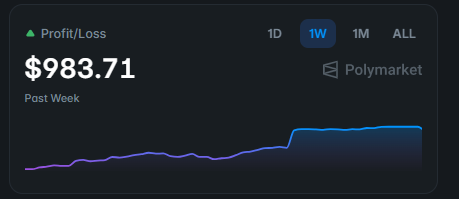
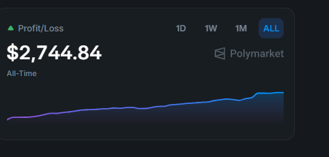
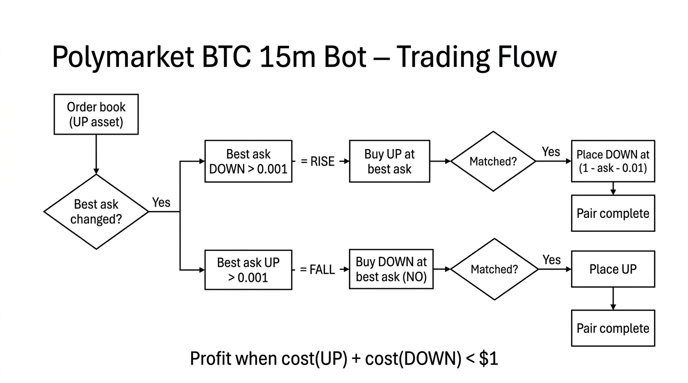

# Polymarket BTC 15m bot

Standalone bots for Polymarket’s BTC 15-minute up/down markets: market WebSocket + 5-deep book + rise/fall detector + pair orders (UP/DOWN), with portfolio tracking, pause/rebalance, and auto-switch to the next 15m market.

Two implementations:

| Project         | Stack        | Run              |
|----------------|--------------|------------------|
| **v2_rust**     | Rust, Cargo  | `cargo run`      |
| **v2_typescript** | Node.js, npm | `npm install && npm start` |

Use one or the other; each has its own `.env` and runs independently.

### Performance (Polymarket P/L)

**Past week**



**Past month**



---

## Install Rust (for v2_rust)

### Ubuntu / Debian

```bash
curl --proto '=https' --tlsv1.2 -sSf https://sh.rustup.rs | sh
source "$HOME/.cargo/env"
rustc --version
cargo --version
```

### Windows

1. Installer: https://win.rustup.rs/x86_64  
   Or: `winget install Rustlang.Rustup`
2. Restart the terminal, then:
   ```powershell
   rustc --version
   cargo --version
   ```

---

## Install Node.js and npm (for v2_typescript)

### Ubuntu / Debian

**Option A — NodeSource (LTS):**
```bash
curl -fsSL https://deb.nodesource.com/setup_lts.x | sudo -E bash -
sudo apt-get install -y nodejs
node --version
npm --version
```

**Option B — system package:**
```bash
sudo apt update
sudo apt install -y nodejs npm
node --version
npm --version
```

### Windows

1. LTS installer from https://nodejs.org/ (ensure “Add to PATH” is checked)  
   Or: `winget install OpenJS.NodeJS.LTS`
2. Restart the terminal, then:
   ```powershell
   node --version
   npm --version
   ```

---

## How to run the Rust bot (v2_rust)

1. Install Rust (see above).
2. Create a `.env` file in the `v2_rust/` directory (see `v2_rust/.env.example`):
   - `PRIVATE_KEY` — wallet private key (0x...) for live orders
   - `DRY_RUN=1` or `true` or `yes` for dry run (no real orders); `DRY_RUN=0` for live
   - Optional: `CLOB_HOST`, `SIGNATURE_TYPE`, `FUNDER_ADDRESS`, etc.
3. Run:

   **Ubuntu / Linux / macOS:**
   ```bash
   cd v2_rust
   cargo run
   ```

   **Windows:**
   ```powershell
   cd v2_rust
   cargo run
   ```

---

## How to run the TypeScript bot (v2_typescript)

1. Install Node.js and npm (see above).
2. Create a `.env` file in the `v2_typescript/` directory (copy from `v2_typescript/.env.example`):
   - `PRIVATE_KEY` — wallet private key (0x...) for live orders
   - `DRY_RUN=1` for dry run; `DRY_RUN=0` for live
   - Optional: `CLOB_HOST`, `POLY_RPC_URL`, `ORDER_SIZE`, etc.
3. Install and run:

   **Ubuntu / Linux / macOS:**
   ```bash
   cd v2_typescript
   npm install
   npm start
   ```

   **Windows:**
   ```powershell
   cd v2_typescript
   npm install
   npm start
   ```

User WSS (live order/fill updates) needs `auth/auth.json` in the project directory; it is created automatically the first time you run with `PRIVATE_KEY` set and the CLOB client derives API credentials.

---

## What the bot does

1. Loads config from `.env`.
2. Fetches the current 15m BTC market from Polymarket Gamma API (slug `btc-updown-15m-{unix}`).
3. Connects to the market WebSocket and subscribes to the YES/NO asset IDs.
4. On each order book update for the UP (yes) asset: builds a 5-deep book, runs the rise/fall detector, and places or cancels CLOB orders when not in dry run.
5. Tracks portfolio (cash, positions, open orders), pauses after N pair orders, rebalances if configured, and switches to the next 15m market when the window ends.

---

## Trading logic (how it aims to make profit)

### High-level flow

  
*Flow: order book → rise/fall signal → first leg (UP or DOWN) → if matched, second leg → pair complete; profit when total cost &lt; $1.*

1. The bot subscribes to the **order book** of the UP (YES) asset for the current 15m BTC market.
2. On every book update it compares the **best ask** to the previous best ask.
3. If the best ask **dropped** by more than 0.001 → **Rise** (market is pricing UP cheaper). If it **increased** by more than 0.001 → **Fall** (market is pricing UP higher).
4. Depending on the signal it places a **first leg** (UP or DOWN); if that order **fills immediately (matched)**, it places the **second leg** at a complementary price. Together the pair aims for combined cost &lt; $1 so the spread is profit.

---

### Markets and tokens

- **Markets:** Polymarket’s **15-minute BTC up/down** markets. Each market asks: “Will BTC be up or down at the end of this 15-minute window?”
- **Tokens:**  
  - **UP (YES)** — pays $1 if BTC is up; trades at a price between 0 and 1.  
  - **DOWN (NO)** — pays $1 if BTC is down; trades between 0 and 1.  
- **Constraint:** UP + DOWN ≈ 1 (e.g. UP at 0.55 ⇒ DOWN about 0.45). Exactly one outcome wins, so one token pays $1 and the other $0.

---

### Signal (rise vs fall)

The bot only watches the **UP asset’s order book** (best bid and best ask).

| Signal | Condition | Meaning |
|--------|----------|--------|
| **Rise** | Best ask **decreased** by &gt; 0.001 vs previous update | Market is offering UP cheaper → short-term move treated as more bullish. |
| **Fall** | Best ask **increased** by &gt; 0.001 vs previous update | Market is offering UP more expensive → short-term move treated as more bearish. |

**When the bot does nothing:**  
- On **rise**, it ignores the signal if **best ask &lt; 0.5** (UP already cheap).  
- On **fall**, it ignores if **best ask &gt; 0.5** (UP already expensive).  

So it only acts when the book *just* moved and the price is still on the “sensible” side of 0.5.

---

### Pair orders (two legs)

Each trade is a **pair** of orders to capture spread, not a single directional bet.

**On Rise:**

1. **First leg:** Buy **UP** at the current **best ask** (take liquidity).
2. If that order **fills immediately (matched):**
   - **Second leg:** Place **DOWN** at a price derived from the other side (e.g. `1 - bestAsk - 0.01`), so you effectively buy the complementary side at a slight discount.

**On Fall:**

1. **First leg:** Buy **DOWN** at the effective best ask for NO (e.g. `1 - bestBid`).
2. If that **matches:**
   - **Second leg:** Place **UP** at a price like `bestBid - 0.01`.

So: **first leg at the current best ask; second leg only when the first fills**, at a price that keeps total cost below $1.

---

### Why this can be profitable

- In a binary market, **UP + DOWN** always pays **$1** (one wins, one loses).
- If you buy **UP at 0.45** and **DOWN at 0.50**, total cost = **0.95**. One of them pays $1, so you lock in about **$0.05 per share** (minus fees).
- The bot tries to do exactly that: **first leg at best ask**, **second leg at a complementary price** so that **combined cost &lt; $1**. The **spread** between your two fills is the profit (or you are market-making around the mid).

---

### Risk controls

- **Liquidity:** Trades only when bid and ask sizes are within `MIN_LIQUIDITY_SIZE` and `MAX_LIQUIDITY_SIZE`.
- **Pause:** After **PAIR_ORDER_LIMIT** pair orders it **pauses for PAUSE_WAIT_SEC**, then resumes (avoids over-trading in one window).
- **Rebalance:** Optional (`REBALANCE_SIZE`, etc.) to adjust position sizes.
- **Dry run:** `DRY_RUN=1` logs orders only; `DRY_RUN=0` sends real orders.

---

## Env variables (both bots)

| Variable              | Description |
|-----------------------|-------------|
| `PRIVATE_KEY`         | Wallet private key (0x...) for live CLOB and allowances |
| `DRY_RUN`            | `1`/`true`/`yes` = no real orders; `0` = live |
| `CLOB_HOST`          | Optional; default `https://clob.polymarket.com` |
| `POLY_RPC_URL`       | Optional; Polygon RPC for allowances |
| `ORDER_SIZE`         | Optional; default 5 |
| `PAIR_ORDER_LIMIT`   | Optional; default 4 (then pause) |
| `PAUSE_WAIT_SEC`     | Optional; default 5 |
| `REBALANCE_SIZE`     | Optional; 0 = off |
| `STARTING_CASH`      | Optional; 0 = no portfolio tracking |
| `LOG_TO_FILE`        | Optional; 1 = append to `db/output.log` |

See each project’s `.env.example` for the full list.

---

## Layout

- **v2_rust/** — Rust implementation (`cargo run`), see `v2_rust/README.md`.
- **v2_typescript/** — TypeScript implementation (`npm start`), see `v2_typescript/README.md`.
- Each has its own `db/`, `auth/`, and `.env`; do not share secrets across projects.

---

## References

- [Polymarket WebSocket](https://docs.polymarket.com/market-data/websocket/overview)
- [Polymarket CLOB](https://docs.polymarket.com/developers/CLOB/)
